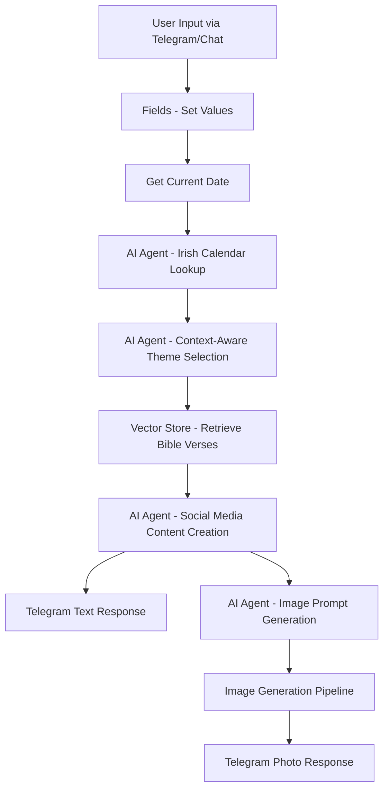

# Bible Quotations Workflow - Refinement Plan

## Document Information
- **Project**: Bible Quotations n8n Workflow
- **Date**: January 10, 2026
- **Version**: 2.0 Enhancement Plan
- **Status**: Planning Phase

---

## Executive Summary

This document outlines the enhancement plan for the Bible Quotations workflow, focusing on adding intelligent daily topic selection based on Irish calendar events and celebrations. The new feature will make content more relevant and timely by connecting biblical themes to current cultural and religious observances in Ireland.

---

## Enhancement Overview

### Primary Goal
Add context-aware topic selection that considers:
- Current date
- Irish holidays and celebrations (religious, national, cultural)
- Seasonal events
- Saints' days (particularly relevant for Irish Catholic traditions)
- Cultural observances

### Expected Outcome
The workflow will automatically:
1. Detect today's date
2. Identify relevant Irish celebrations/holidays
3. Suggest appropriate spiritual themes connected to these events
4. Generate contextual Bible quotations that resonate with the day's significance

---

## Architecture Changes

### New Workflow Structure

```
Current Flow:
Telegram/Chat Trigger → Fields Setup → AI Agent (Theme) → AI Agent (Content) → Image Gen → Output

Enhanced Flow:
Telegram/Chat Trigger → Fields Setup → Get Current Date → 
→ AI Agent (Irish Calendar Lookup) → 
→ AI Agent (Theme Selection with Context) → 
→ AI Agent (Content Creation) → 
→ Image Generation → 
→ Output
```

### Node Additions

#### **1. Get Current Date Node**
- **Type**: `Code` or `n8n-nodes-base.dateTime`
- **Position**: After "Fields - Set Values", before theme selection
- **Purpose**: Extract current date in structured format

**Implementation**:
```javascript
// Code Node: Get Current Date
const now = new Date();
const irishTime = new Date(now.toLocaleString('en-US', { timeZone: 'Europe/Dublin' }));

return [{
  json: {
    date: irishTime.toISOString().split('T')[0], // YYYY-MM-DD
    dayOfWeek: irishTime.toLocaleDateString('en-IE', { weekday: 'long' }),
    dayOfMonth: irishTime.getDate(),
    month: irishTime.getMonth() + 1,
    monthName: irishTime.toLocaleDateString('en-IE', { month: 'long' }),
    year: irishTime.getFullYear(),
    liturgicalSeason: '', // To be filled by AI
    formattedDate: irishTime.toLocaleDateString('en-IE', { 
      weekday: 'long', 
      year: 'numeric', 
      month: 'long', 
      day: 'numeric' 
    })
  }
}];
```

#### **2. AI Agent - Irish Calendar & Celebrations Lookup**
- **Type**: `@n8n/n8n-nodes-langchain.agent`
- **Position**: Between date node and theme selection
- **LLM**: Google Gemini Chat Model (can reuse existing credentials)
- **Purpose**: Identify Irish celebrations, holidays, and observances

**System Message**:
```markdown
**Role**: Irish Cultural & Liturgical Calendar Expert

**System Message**:
> "You are an expert on Irish culture, religious observances, national holidays, and the liturgical calendar. 
> Given a specific date, identify ALL relevant celebrations, holidays, and observances in Ireland, including:
>
> **Categories to Check**:
> 1. **National Holidays**: Bank holidays, public holidays (e.g., St. Patrick's Day, Easter Monday)
> 2. **Religious Observances**: Catholic feast days, saints' days (especially Irish saints)
> 3. **Liturgical Calendar**: Advent, Lent, Easter, Ordinary Time, etc.
> 4. **Cultural Events**: Traditional Irish celebrations (e.g., Imbolc, Bealtaine)
> 5. **Seasonal Events**: Harvest festivals, seasonal transitions
> 6. **Commemorative Days**: Historical remembrances
>
> **Output Format** (JSON):
> {
>   "date": "YYYY-MM-DD",
>   "primaryCelebration": "Main celebration name or 'None'",
>   "celebrations": [
>     {
>       "name": "Celebration name",
>       "type": "religious|national|cultural|liturgical|seasonal",
>       "significance": "Brief description",
>       "relevance": "high|medium|low"
>     }
>   ],
>   "liturgicalSeason": "Season name",
>   "suggestedThemes": ["Theme 1", "Theme 2", "Theme 3"],
>   "culturalContext": "Brief context about this day in Irish tradition"
> }
>
> **Important Notes**:
> - Include both Catholic and broader Christian observances
> - Prioritize celebrations with high cultural significance in Ireland
> - For ordinary days, note the liturgical season and suggest universal themes
> - Be specific about Irish saints and local traditions"
```

**Input Configuration**:
```javascript
text: "={{ 'What celebrations, holidays, or observances occur in Ireland on ' + $('Get Current Date').item.json.formattedDate + ' (' + $('Get Current Date').item.json.date + ')? Please provide comprehensive information including religious, national, cultural, and liturgical calendar events.' }}"
```

**Options**:
- Temperature: `0.3` (factual accuracy is critical)
- Max tokens: `2048`

#### **3. Enhanced AI Agent - Context-Aware Theme Selection**
- **Type**: Modify existing `AI Agent1` (Content Planner)
- **Changes**: Update system message to incorporate celebration data

**Updated System Message**:
```markdown
**Role**: Context-Aware Spiritual Content Planner

**System Message**:
> "You are a wise and thoughtful content planner for a Christian Facebook page serving an Irish audience. 
> Your goal is to select a single, uplifting, and relevant spiritual theme for today's post.
>
> **Context You'll Receive**:
> - Today's date and day of week
> - Irish celebrations, holidays, or observances occurring today
> - Liturgical season information
> - Cultural context for Irish traditions
>
> **Theme Selection Guidelines**:
> 1. **If there's a significant celebration**: Choose a theme directly related to that observance
>    - Example: St. Patrick's Day → "Faith and Mission" or "Bringing Light to Others"
>    - Example: All Saints' Day → "Heavenly Hope" or "The Communion of Saints"
>
> 2. **If it's a liturgical season**: Align with seasonal themes
>    - Advent → Hope, Waiting, Preparation
>    - Lent → Reflection, Repentance, Renewal
>    - Easter Season → Resurrection, New Life, Joy
>
> 3. **For ordinary days**: Select universal, encouraging themes
>    - Hope, Patience, Kindness, Strength in Adversity, God's Love, Peace
>
> 4. **Cultural Sensitivity**: Honor Irish Catholic traditions while being inclusive
>
> **Output**: Return ONLY the theme name (2-4 words)
>
> **Examples**:
> - Input: "St. Brigid's Day" → Output: "Light and Hospitality"
> - Input: "Good Friday (Lent)" → Output: "Redemption and Sacrifice"
> - Input: "Ordinary Tuesday in June" → Output: "Daily Grace"
```

**Input Configuration**:
```javascript
text: "={{ 'User request: ' + $('When chat message received').item.json.chatInput + '\n\nToday is: ' + $('Get Current Date').item.json.formattedDate + '\n\nIrish Calendar Context:\n' + $('AI Agent - Irish Calendar').item.json.output + '\n\nPlease select an appropriate spiritual theme.' }}"
```

---

## Data Flow Diagram

### Enhanced Processing Pipeline



---

## Implementation Steps

### Phase 1: Date & Calendar Integration (Priority: High)

**Step 1.1**: Add Get Current Date Node
- [ ] Create Code node after "Fields - Set Values"
- [ ] Implement JavaScript date extraction with Irish timezone
- [ ] Test output structure
- [ ] Verify timezone accuracy (Europe/Dublin)

**Step 1.2**: Create Irish Calendar Lookup Agent
- [ ] Add new AI Agent node
- [ ] Connect to Google Gemini Chat Model (create new instance or reuse)
- [ ] Configure system message with comprehensive calendar knowledge
- [ ] Set temperature to 0.3 for factual accuracy
- [ ] Connect input from Get Current Date node
- [ ] Test with various dates (holidays, ordinary days, liturgical seasons)

**Step 1.3**: Update Theme Selection Agent
- [ ] Modify existing "AI Agent1" (Content Planner)
- [ ] Update system message to accept calendar context
- [ ] Reconfigure input to include celebration data
- [ ] Test theme selection with different celebrations

**Step 1.4**: Update Node Connections
- [ ] Connect: Fields → Get Current Date → Irish Calendar Agent → Theme Agent → Content Agent
- [ ] Verify all downstream connections remain intact
- [ ] Test complete flow end-to-end

### Phase 2: Testing & Validation (Priority: High)

**Step 2.1**: Test Irish Holidays
Test dates:
- [ ] March 17 (St. Patrick's Day)
- [ ] February 1 (St. Brigid's Day)
- [ ] December 25 (Christmas)
- [ ] Various saints' days
- [ ] Liturgical seasons (Advent, Lent, Easter)

**Step 2.2**: Test Ordinary Days
- [ ] Random weekdays with no major celebrations
- [ ] Verify graceful handling of "no celebration" scenarios
- [ ] Confirm theme selection remains relevant

**Step 2.3**: Edge Cases
- [ ] Test across timezone boundaries (midnight edge cases)
- [ ] Test during leap years
- [ ] Test with multiple celebrations on same day

### Phase 3: Optimization (Priority: Medium)

**Step 3.1**: Performance
- [ ] Monitor API token usage (calendar lookup adds one more AI call)
- [ ] Consider caching calendar data for frequently queried dates
- [ ] Optimize prompt length to reduce costs

**Step 3.2**: Knowledge Enhancement
- [ ] Create supplementary calendar database (optional)
- [ ] Add HTTP Request to Irish calendar API if available
- [ ] Integrate with liturgical calendar APIs (e.g., Catholic Liturgical Calendar API)

**Step 3.3**: User Customization
- [ ] Add option for users to override auto-detected celebration
- [ ] Allow manual theme specification when needed
- [ ] Create admin commands for testing specific dates

---

## Optional Enhancements

### Enhancement 1: Calendar API Integration
**Alternative to AI-only approach**: Query external APIs for guaranteed accuracy

**Potential APIs**:
1. **Calendarific API**: Public holidays for Ireland
   - Endpoint: `https://calendarific.com/api/v2/holidays`
   - Requires API key (free tier available)
   
2. **Catholic Liturgical Calendar API**: 
   - Endpoint: `http://calapi.inadiutorium.cz/api/v0/en/calendars/default/{year}/{month}/{day}`
   - Free, no authentication required

**Implementation**:
```
Get Current Date → HTTP Request (Calendar APIs) → Parse JSON → 
→ AI Agent (Interpret & Select Theme) → Continue Workflow
```

**Benefits**:
- More accurate date data
- Reduced AI token costs for factual lookups
- Faster response times

**Trade-offs**:
- External dependency (API availability)
- May require API key management
- Less flexible than pure AI approach

### Enhancement 2: Multi-Country Support
**Future expansion**: Support multiple countries' celebrations

**Implementation**:
- Add country selection in user input or configuration
- Create country-specific calendar lookup agents
- Route to appropriate agent based on country parameter

**Countries to Consider**:
- Ireland (primary)
- United Kingdom
- United States
- Australia
- Other English-speaking Christian communities

### Enhancement 3: Celebration Image Customization
**Visual theming**: Adjust image generation based on celebration type

**Implementation**:
- Pass celebration type to image prompt generator
- Include cultural symbols (shamrocks for St. Patrick's Day, etc.)
- Adjust color palettes for liturgical seasons (purple for Lent, white for Easter)

**Example Enhancement**:
```javascript
// In image prompt generation
const culturalSymbols = {
  "St. Patrick's Day": "shamrocks, Celtic crosses, green tones",
  "Christmas": "nativity scenes, warm golden light",
  "Easter": "lilies, sunrise, bright white and gold"
};
```

### Enhancement 4: Notification Scheduling
**Automated daily posting**: Schedule workflow to run automatically

**Implementation**:
- Replace manual/chat trigger with Schedule Trigger
- Set to run daily at optimal posting time (e.g., 8:00 AM Irish time)
- Auto-post to Facebook/social media
- Send admin notification on completion

**Benefits**:
- Consistent daily content
- No manual intervention required
- Builds audience expectation

---

## Testing Checklist

### Functional Testing
- [ ] Date extraction works correctly in Irish timezone
- [ ] Calendar lookup identifies Irish holidays accurately
- [ ] Theme selection appropriately reflects celebrations
- [ ] Bible verse retrieval returns contextual verses
- [ ] Content generation mentions the celebration naturally
- [ ] Image prompts reflect celebration themes
- [ ] Output delivered successfully to Telegram

### User Experience Testing
- [ ] Response time is acceptable (< 30 seconds total)
- [ ] Generated content is appropriate and engaging
- [ ] Images match the textual content
- [ ] No errors occur during execution

### Edge Case Testing
- [ ] Works on days with no celebrations
- [ ] Handles multiple celebrations on same day
- [ ] Processes correctly during timezone shifts
- [ ] Gracefully handles API failures (if using external APIs)

---

## Resource Requirements

### New Nodes Required
1. **Get Current Date** (Code node) - Free
2. **AI Agent - Irish Calendar Lookup** - ~500-1000 tokens per execution
3. **Modified Theme Selection Agent** - ~200-500 additional tokens per execution

### Estimated Cost Impact
- **Current workflow**: ~3 AI agent calls
- **Enhanced workflow**: ~4 AI agent calls
- **Additional cost per execution**: ~15-25% increase in token usage
- **Mitigation**: Use lower temperature (0.3) for calendar lookup to reduce tokens

### API Credentials Required
- Existing: Google Gemini API (already configured)
- Optional: Calendar API key (if using external calendar service)

---

## Risk Assessment

### Low Risk
- ✅ Date extraction (standard JavaScript functionality)
- ✅ Theme selection enhancement (minor prompt modification)
- ✅ Node connection updates (straightforward)

### Medium Risk
- ⚠️ AI accuracy for Irish calendar (mitigation: test extensively)
- ⚠️ Token usage increase (mitigation: optimize prompts)
- ⚠️ Timezone handling edge cases (mitigation: thorough testing)

### Mitigation Strategies
1. **AI Accuracy**: Supplement with external calendar API for critical dates
2. **Cost Control**: Monitor token usage; consider caching common dates
3. **Reliability**: Add error handling in all new code nodes
4. **Fallback**: If calendar lookup fails, revert to generic theme selection

---

## Success Metrics

### Qualitative
- [ ] Generated content appropriately references current celebrations
- [ ] Themes feel timely and relevant to Irish audience
- [ ] User engagement increases on celebration days

### Quantitative
- [ ] 95%+ accuracy in identifying major Irish holidays
- [ ] < 5% increase in execution time
- [ ] < 25% increase in API costs
- [ ] 100% success rate in workflow execution (no errors)

---

## Timeline

### Week 1: Development
- Days 1-2: Implement date extraction and calendar lookup
- Days 3-4: Update theme selection and test integration
- Days 5-7: End-to-end testing and refinement

### Week 2: Validation
- Days 1-3: Test with historical dates covering full calendar year
- Days 4-5: User acceptance testing
- Days 6-7: Bug fixes and optimization

### Week 3: Deployment
- Days 1-2: Deploy to production
- Days 3-7: Monitor and iterate based on real-world performance

---

## Documentation Updates Needed

1. **Update `.copilot-instructions.md`**:
   - Add section on context-aware topic selection
   - Document calendar integration pattern
   - Add best practices for timezone handling

2. **Create `IRISH-CALENDAR-REFERENCE.md`**:
   - List of major Irish holidays
   - Suggested themes for each celebration
   - Liturgical calendar reference

3. **Update workflow comments**:
   - Add node descriptions
   - Document data flow through new nodes

---

## Rollback Plan

If issues arise during deployment:

1. **Immediate Actions**:
   - Disable new nodes (Get Current Date, Calendar Lookup)
   - Reconnect original flow: Fields → AI Agent1 (Theme) → Continue
   - Workflow reverts to original functionality

2. **Data Preservation**:
   - Export workflow before making changes
   - Save as "Bible Quotations v1.0 (backup)"
   - Keep version history in n8n

3. **Troubleshooting Steps**:
   - Check node execution logs
   - Verify AI model responses
   - Test date/time accuracy
   - Validate JSON parsing in code nodes

---

## Future Considerations

### Version 3.0 Potential Features
- Multi-language celebration detection (Irish Gaelic names for saints)
- Integration with parish bulletin systems
- Personalized content based on user location within Ireland
- Historical "on this day" biblical events
- Saint of the day biographical snippets

### Scalability
- Support for other countries' calendars
- Multi-denominational observance tracking
- Interfaith celebration awareness

---

## Conclusion

This refinement plan enhances the Bible Quotations workflow with intelligent, context-aware topic selection that honors Irish cultural and religious traditions. By automatically detecting and incorporating current celebrations, the workflow will generate more timely, relevant, and engaging content for the Irish Christian community.

**Next Steps**:
1. Review and approve this plan
2. Begin Phase 1 implementation
3. Schedule testing with key Irish calendar dates
4. Deploy and monitor performance

---

**Document Owner**: AI Development Team  
**Review Date**: January 10, 2026  
**Status**: Awaiting Approval  
**Version**: 1.0
